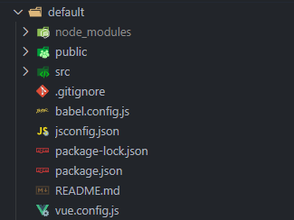
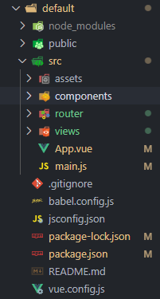

# AP05 - Implementação de Aplicação Web com Node.js e Vue.js

Neste projeto foi utilizado o [Vue CLI](https://cli.vuejs.org/#getting-started), o [Bootstrap](https://getbootstrap.com/) para construir este projeto e o gerenciador de pacotes [NPM](https://docs.npmjs.com/getting-started) para realizar a instalação dos pacotes.

## Preparando o projeto

### Iniciando Projeto vue

Para iniciar foi criado um projeto Vue CLI com os comandos:

- para instalar o Vue CLI:

        npm install -g @vue/cli
  
- para criar o projeto:

        vue create "nome_do_projeto"
  
  Esse comando cria uma estrutra de arquivos padrão, logo após a execução do comando, podemos selecionar qual versão do vue queremos utilizar, eu utilizei o vue 2 e então podermos construirmos oque desejamos.

#### Vue Router

Para poder utilizar um sistema de paginas, foi utilizado o [Vue Router](https://router.vuejs.org/) que me permite criar rotas para outras paginas.
- Instalando:

        npm install vue-router@4
- Adicionando ao projeto:

        vue add router
Após esses comando, a estrutura ficará assim:

- Na pasta router é aonde sera especificado a rota de cada pagina.
- E na pasta views sera aonde ficara as paginas criadas.

### Bootstrap

Para deixar o projeto mais bonito vizualmente foi utilizado o [Bootstrap](https://getbootstrap.com/)

- Instalando:

        npm install --save bootstrap
        npm install --save @popperjs/core
- Adicionando ao projeto:
        Dentro do arquivo main.js foi inserido o seguinde texto.

        import "bootstrap/dist/css/bootstrap.min.css"
        import "bootstrap"

## Projeto
Agora com tudo necessario instalado e pronto, começamos a construir o nosso projeto da nosa maneira. O intuito do meu projeto é construir um tipo de bloco de notas, aonde a parte de anotações é separado da parte aonde as notas ficam salvas.

Para separar essas paginas:

- Criamos as rotas dentro do arquivo index.js.

        const routes = [
                {
                        path: '/path_1',
                        name: 'nome_1',      
                        component: () => import('../views/page_1.vue')
                },
                {
                        path: '/path_2',
                        name: 'nome_2',
                        component : () => import('../views/page_2.vue'),
                }
        ]
Criamos agora as nossas paginas dentro da pasta views, elas serão construidas como arquivos com a extensão ".vue" o que nos permite contruir a pagina personalizar o css dela e também criar os scripts dela.

- Estrutura padrão para uma página .vue:

        <template>

        </template>

        

        

Para finalizar o projeto, basta modificarmos os router-link dentro do arquivo App.vue, e só então toda a estrutura do nosso projeto estara pronto e funcionando

## Finalizando
E claro que neste documento esta tudo muito resumido sem nenhum detalhe só um pequeno passo-a-passo de como eu construi meu projeto.

Então para realizar os teste, foi utilizando o comando no terminal:
        
        npm run serve --oque faz nosso projeto ficar  hospedado locamente--

Porém eu preferi utilizar outra solução, eu upei todo meu projeto em um [repositório GitHub](https://github.com/ViniciusVViana/TDS-AP05) e então fiz o deploy dele na plataforma de hospedagem gratuita Vercel.

[Clique aqui para acesar o projeto hospedado em rede.](https://ap05.vercel.app)